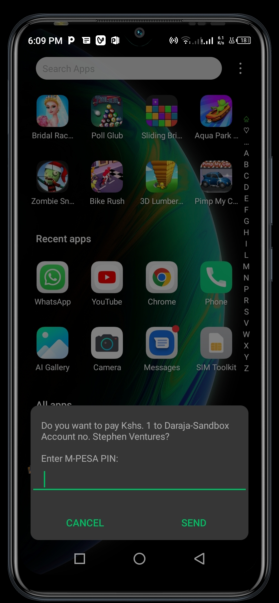
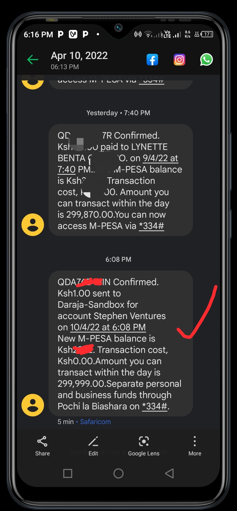
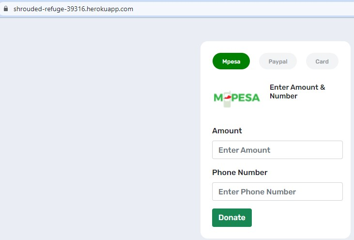

# REQUIREMENTS
- Working domain.
 eg. Register your site with heroku, netlify etc.
- Download and install heroku command line(cml).Visit to download, https://devcenter.heroku.com/articles/heroku-cli
- Create an account with heroku
-Create a new repository in git and push your code
- Visual studio : in terminal write:
  heroku new
  heroku create
  git push heroku (your github branch) eg.git push heroku master
  

# Daraja-2.0-B2C-Intergration👨‍💻
made with 💖 BY Stephen Muindi

edit the credentials in stk_initiate.php and it will work perfectly😎🌈

# Daraja APi Real pop up screen payment by the Stk push 
 
)

  

# Visit Below site to also learn how it functions.
https://shrouded-refuge-39316.herokuapp.com/

NB: Remember to have a working domain, for this case, i have used heroku.com.

# The site

